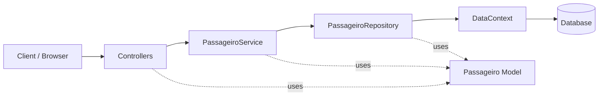

# PETviagens
A REST API built with **ASP.NET Core** to manage travel passengers. This project was created as a learning exercise to practice backend development in .NET, including layered architecture, Entity Framework Core, and SQL Server integration.

## About
**PETviagens** (PET Travels) is a passenger management API for a fictional travel company. It provides full **CRUD** operations (Create, Read, Update, Delete) for registered passengers, storing data in a **SQL Server** database.
Each passenger record includes personal information and trip details such as destination, travel type, partner company, and departure time.

## Tech Stack
- [.NET 6](https://dotnet.microsoft.com/)
- [ASP.NET Core](https://docs.microsoft.com/aspnet/core)
- [Entity Framework Core 7](https://docs.microsoft.com/ef/core/)
- [SQL Server](https://www.microsoft.com/sql-server)
  
## Architecture
The project follows a **layered architecture** to separate concerns:

Controller → Service → Repository → DataContext → SQL Server

| Layer | Responsibility |
|-------|----------------|
| **Controller** (`PassageiroController`) | Handles HTTP requests and responses |
| **Service** (`PassageiroService`) | Business logic and validation |
| **Repository** (`PassageiroRopository`) | Data access operations |
| **DataContext** | Entity Framework Core database context |


## Project Structure


## Getting Started

### Prerequisites

- [.NET 6 SDK](https://dotnet.microsoft.com/download/dotnet/6.0)
- [SQL Server](https://www.microsoft.com/sql-server/sql-server-downloads) (local or remote instance)
- A tool to test the API (e.g. [Postman](https://www.postman.com/) or [curl](https://curl.se/))

### Installation

1. Clone the repository:

```bash
git clone https://github.com/Medeiroshenrique/PETviagens.git
cd PETviagens
```

2. Create the database in SQL Server (e.g. PETviagens) and ensure the Passageiro table exists with the expected columns.

3. Update the connection string in appsettings.json:
```
"ConnectionStrings": {
  "WebApiDatabase": "server=YOUR_SERVER;database=PETviagens;user=YOUR_USER;password=YOUR_PASSWORD;Trust Server Certificate=true"
}
```
4. Run the application:
```
dotnet run
```
The API will be available at:

HTTPS: https://localhost:7294 <br>
HTTP: http://localhost:5294

API Endpoints
Base URL: /api/passageiros
| Method | Endpoint                          | Description               |
|--------|-----------------------------------|---------------------------|
| GET    | `/api/passageiros`                | List all passengers       |
| GET    | `/api/passageiros/{idpassagem}`   | Get a passenger by ID     |
| POST   | `/api/passageiros`                | Create a new passenger    |
| PUT    | `/api/passageiros`                | Update an existing passenger |
| DELETE | `/api/passageiros/{idpassagem}`   | Delete a passenger by ID  |


Passenger Model
```json
{
  "idPassagem": 1,
  "nome": "João",
  "sobrenome": "Silva",
  "sexo": "M",
  "tipoViagem": "Nacional",
  "destinoViagem": "Rio de Janeiro",
  "empresaParceira": "PET Airlines",
  "horaDecolagem": "14:30"
}
```

Example Requests
List all passengers:
```
curl -X GET https://localhost:7294/api/passageiros
```
Get passenger by ID:

```
curl -X GET https://localhost:7294/api/passageiros/1
```

Create a passenger:
```
curl -X POST https://localhost:7294/api/passageiros \
  -H "Content-Type: application/json" \
  -d '{
    "nome": "Maria",
    "sobrenome": "Santos",
    "sexo": "F",
    "tipoViagem": "Internacional",
    "destinoViagem": "Lisboa",
    "empresaParceira": "PET Airlines",
    "horaDecolagem": "08:00"
  }'
```

Update a passenger:
```
curl -X PUT https://localhost:7294/api/passageiros \
  -H "Content-Type: application/json" \
  -d '{
    "idPassagem": 1,
    "nome": "Maria",
    "sobrenome": "Santos",
    "sexo": "F",
    "tipoViagem": "Internacional",
    "destinoViagem": "Porto",
    "empresaParceira": "PET Airlines",
    "horaDecolagem": "10:00"
  }'
  ```

Delete a passenger:
```
curl -X DELETE https://localhost:7294/api/passageiros/1
```

# What I Learned

- Built REST APIs with **ASP.NET Core**
  - `[ApiController]`
  - Routing
  - HTTP verbs (GET, POST, PUT, DELETE)

- Used **Entity Framework Core** for:
  - Database mapping
  - CRUD operations

- Applied a **Layered Architecture**
  - Controller → Service → Repository

- Integrated **SQL Server**
  - Connection strings
  - `DbContext`

- Organized a backend project with a clear **separation of concerns**
